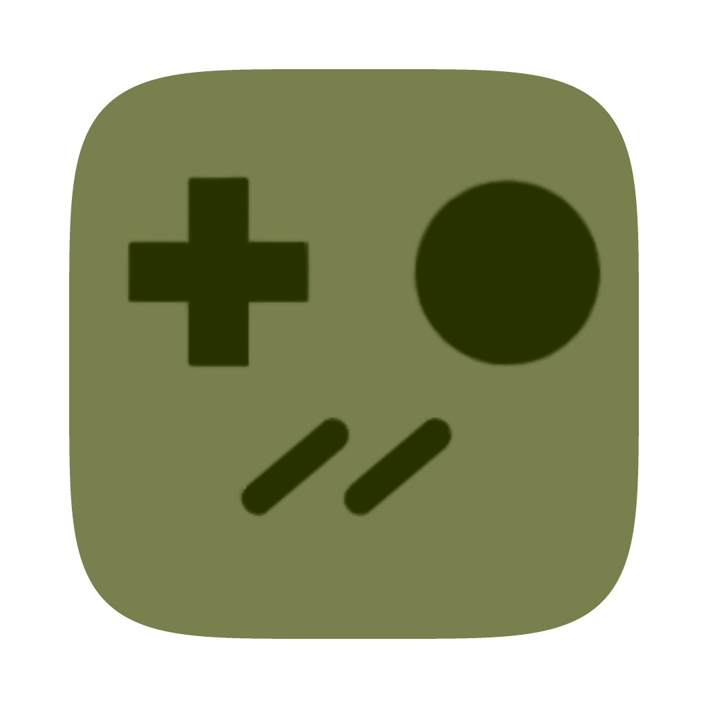

<div align="center">



# gameboy-emu

**A Game Boy emulator written from scratch in C++**


</div>

https://github.com/user-attachments/assets/81d463ea-14fc-42f1-a90f-8be842564cd4

---

## Overview

No frameworks, no borrowed cores — the CPU, PPU, timer, interrupt controller and cartridge
mappers are all implemented here from the hardware documentation. On top of that sits a
hand-drawn Dear ImGui frontend: a cover-art carousel that mounts each game's box art into a
Game Boy cartridge shell, live settings, rebindable keys, and the whole thing compiles
unchanged for iOS.

## Emulation

| Component | Status |
|---|---|
| **CPU** | Full Sharp LR35902 set — 256 base + 256 CB-prefixed opcodes, M-cycle accurate, with the EI 1-instruction delay and the HALT bug |
| **PPU** | Background, window and sprites; full LCDC handling, sprite priority and flipping, palette mapping, LY=LYC coincidence, STAT mode interrupts |
| **Timer** | DIV / TIMA / TMA / TAC driven off the internal divider with proper falling-edge detection |
| **Interrupts** | VBlank, STAT, Timer and Joypad with correct dispatch timing and IME semantics |
| **DMA** | OAM transfer via `$FF46`, cycle-stepped against the CPU |
| **Cartridges** | MBC1, MBC3 and MBC5 bank switching with external RAM |
| **Boot** | Post-boot register and I/O state, so games start without a boot ROM |

### Test ROMs

| Suite | Result |
|---|---|
| Blargg `cpu_instrs` | 11 / 11 |
| Blargg `instr_timing` | pass |
| dmg-acid2 | pixel-perfect |
| Mooneye timing (`call`, `push`, `rst`, `ei`, `intr`, `tima_reload`) | pass |
| Mooneye `intr_2_mode0_timing` | fails — needs sub-scanline PPU mode timing |

Playable and verified: Tetris, Dr. Mario, Kirby's Dream Land 1–2, Super Mario Land 1–2,
Wario Land, Link's Awakening, Mega Man II, DuckTales, Pokémon Red / Blue / Yellow.

## Frontend

- **Cartridge carousel** — each game's box art is composited into a Game Boy cartridge shell, with real blurred drop shadows and momentum scrolling.
- **Settings** — screen fit (normal / crop / stretch), menu frame cap up to unlimited, VSync, HiDPI rendering, cartridge rendering toggle.
- **Rebindable keys** — every button remappable from the UI.
- **Persistence** — settings, keybinds, window size and window position are restored on launch.
- **Live resize** — the framebuffer follows the window while you drag it, not after.
- **Add games** — native file picker on desktop, the system document picker on iOS.
- **Native packaging** — a real macOS `.app` bundle with light/dark app icons, and an iOS app with touch controls.

## Build

Dependencies are git submodules, so clone recursively:

```bash
git clone --recurse-submodules https://github.com/iediot/gameboy-emulator.git
cd gameboy-emulator
```

Already cloned flat? `git submodule update --init --recursive`

### Desktop (macOS / Linux)

Needs CMake, SDL2 and SDL2_image.

```bash
cmake -B build
cmake --build build
```

On macOS this produces `build/GBEmulator.app` — double-click it, or drop it in
`/Applications`. On Linux it produces `build/gameboy_emu`.

### iOS

SDL is built from source for this target, so no system SDL is needed.

```bash
cmake -B build-ios -G Xcode \
      -DCMAKE_SYSTEM_NAME=iOS \
      -DGB_DEV_TEAM=<your team id>
open build-ios/gameboy_emu.xcodeproj
```

Then pick your device and hit run. Omit `-DGB_DEV_TEAM` to choose the signing team inside
Xcode, or target the simulator, which needs no signing at all.

## Controls

Defaults — all rebindable in **Settings → Keybinds**.

| Game Boy | Key |
|---|---|
| D-pad | Arrow keys |
| A | `Z` |
| B | `X` |
| Start | `Enter` |
| Select | `Backspace` |
| Back to menu | `Esc` |

On iOS the d-pad and buttons are drawn as touch zones over the screen.

## Where things live

ROMs and cover art are read from the app's support directory, and dropped-in games are
copied there:

```
~/Library/Application Support/com.iediot/gbemu/
├── game-roms/      # .gb files
└── settings.txt    # scale, frame cap, vsync, hidpi, window geometry, keybinds
```

Cover art is matched to a ROM by fuzzy name comparison against `artworks/`, so
`Super Mario Land 2 - 6 Golden Coins (USA, Europe) (Rev 2).gb` still finds its box art.

## Roadmap

- [ ] APU — audio is the big missing piece
- [ ] Battery-backed saves written to `.sav`
- [ ] Save states
- [ ] Sub-scanline PPU timing (mid-scanline register writes, `intr_2_mode0_timing`)
- [ ] Adjustable game speed / fast-forward
- [ ] Game Boy Color support
